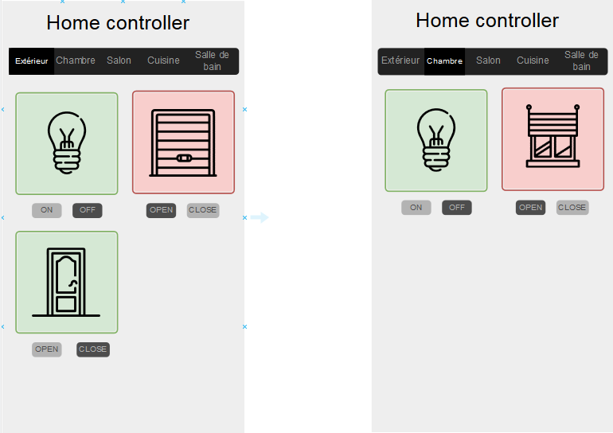
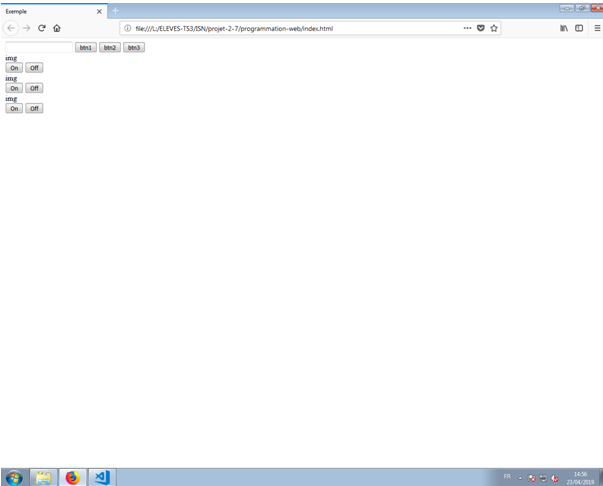
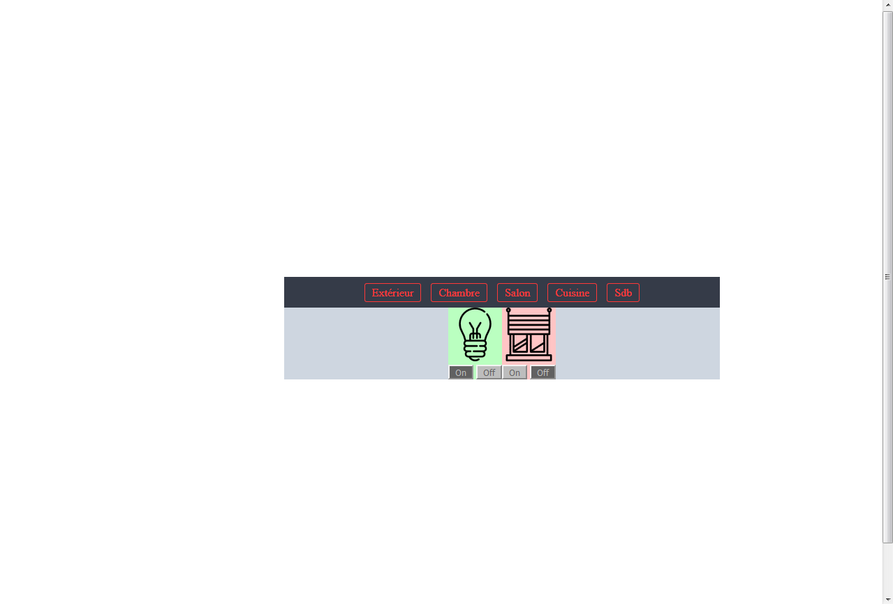
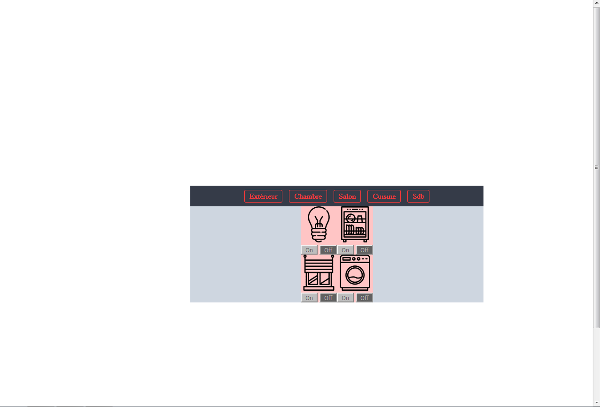
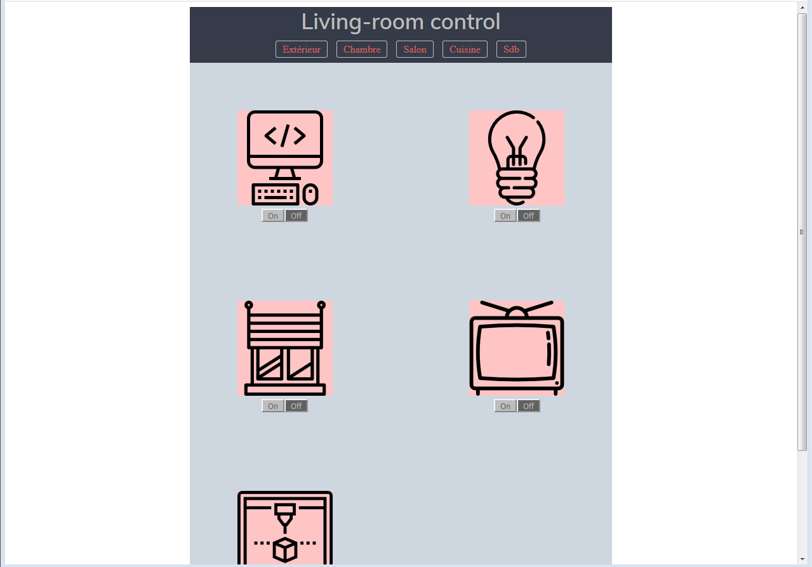
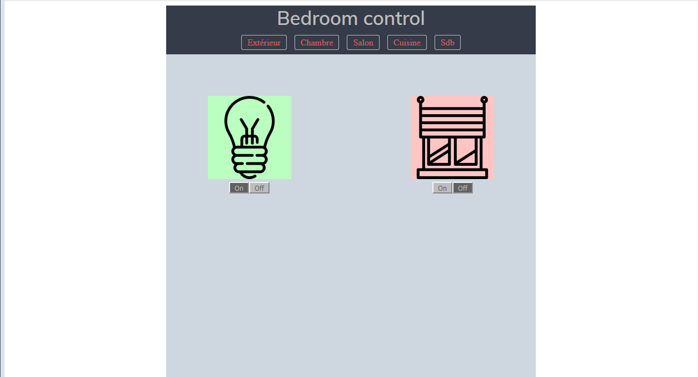

# Projet :MAISON.

​

## But du projet

Le projet consiste à réaliser une maquette d'une maison, grace à un site, l'appui sur touche particulière réalise une action au sein de la maison.(ex:lampe allumé ou porte ouverte ect... exprimé par une LED éteinte ou allumé )

Le partage des tache sont: Coralie fait le javascript(serveur) et arduino , Mathilde et moi(Kyle) nous occuperons du html javascript et css pour la page du site, nous réalisons ensuite à trois la maquette.

​

## Membres du groupe

Fernandez Coralie , Linari Mathilde , Polizzi Kyle

​

## Calendrier des séances

​

### 02/04/2019: 1ère séance

Mise en situation, test du prototype réalisé par les soins de coralie.

explication de sa réalisation pour nous.

test à faire dès que tout sera mise au point(configuration) avec l'aide de Mathilde.

pour le début je m'exerce sur le readme.

Malheureusement ; un problème est survenu du à un parmettre lors du développement qu'il faut que Coralie récupère chez elle sur son environnement de développement.

​

Ceci est un prototype des boutons(placé sur le site):

​

​

ET ensuite explication du projet à réaliser:

### 23/04/2019: 2eme séance:

​

Aujourd'hui avec mathilde nous allons nous occuper du css pour la page d'acceuil du site, ainsi permettre un visuel adécuate pour la réalisation des tache à effectuer dans la maison. La réalisation se fait par un codage html pour fairez le fond de la page d'acceuil, on se sert de visual studio code , base faite à la maison qu'il faut améliorer.

Coralie a réaliser pendant les vacances la connection site ; serveur ; arduino ce qui permet la réalisation de lampe allumé ou éteinte. Il lui reste à poffiner le faite que l'arduino envoie l'état des lampes au site et permettre l'ajout de couleurs pour la page du site pour nous.(indiquer les états via des couleurs).Malheureusement comme la dernière fois l'arduino n'est pas reconnu par le pc, le fichier .ino se situe dans home-controller-arduino/home-controller-arduino.

Mathilde et moi meme avons rajouter 2 nouvelles pages :Salon et Chambre .
Nous avons après plusieurs et longues minutes Réussi a plaçé les fichier dans iaca ;Ts3;ISN;Projet2/7.

### 30/04/2019: 3eme séance:
Aujourd'hui Coralie continue à faire des vérification mais depuis son pc et cette fois ci l'arduino marche avec les lampes bien allumé. Nous lui ramenons les fichier requis pour les touches pour voir l'efficacité de nos codages.
Nous ,avec mathilde continuons le codage html pour tous les boutons et si possible commencer la mise en page par css.
Pour une prévisualisation de notre avancé aujourd'hui voir les 2 vidéo: "Teste_LED" et "Teste_site" dans "Projet-2-7" "programmation-web" si possible merci.
On a cherché les icones pour les images des bouttons sur Flaticon.
On a placé les images sur le site ils ne restes plus qu'a les réduire et bien les placé.

​
### 07/05/2019: 4eme séance:
Aujourd'hui Coralie a ramené le début de la maquette, elle va s'occuper de tester les LED ainsi que d'étiquetter les cables des LED.
Mathilde et moi nous allons continuer le css pour la mise en forme. 

### 14/05/2019: 5eme séance:
Coralie aujourd'hui va essayer de faire marcher la maquette sur l'ordinateur et Mathilde et moi allons continuer le css et permettre la suite de la mise een forme de la page en réctifiant le probleme de notre flex qui ne marche pas sur toute les images.
Ne fonctionne toujours pas sur le pc du lycée et problème par rapport a node.js,surement la version qui est mauvaise.
Réglé problème du flex est bientot fini.
Notre css n'est pas fini mais nous avons un début de page de présentation:

### 21/05/2019: 6eme séance:
Avec Mathilde nous finissons le css et Coralie ayant réglé son problème elle apporte son aide en cas de soucis.
Explication du projet à Mr.Tixidor.
La dernière version du css se trouve dans salle de bain(Sdb)
Chemin pour atteindre la page internet:
U:\Documents\Devoirs\abel\isn\projet\projet-2-7\programmation-web\poc-web-arduino-ts\src\server\public
ouvrir avec internet Sdb.html par exemple.

### 28/05/2019: 7eme séance:
Nous terminons le projet.

